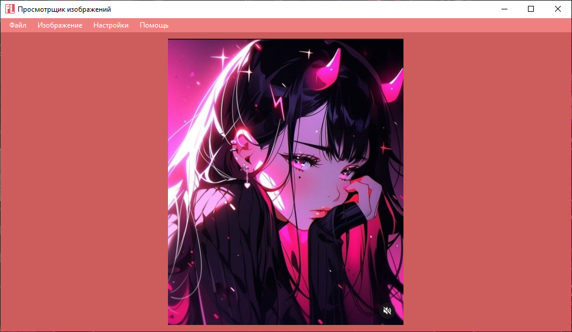
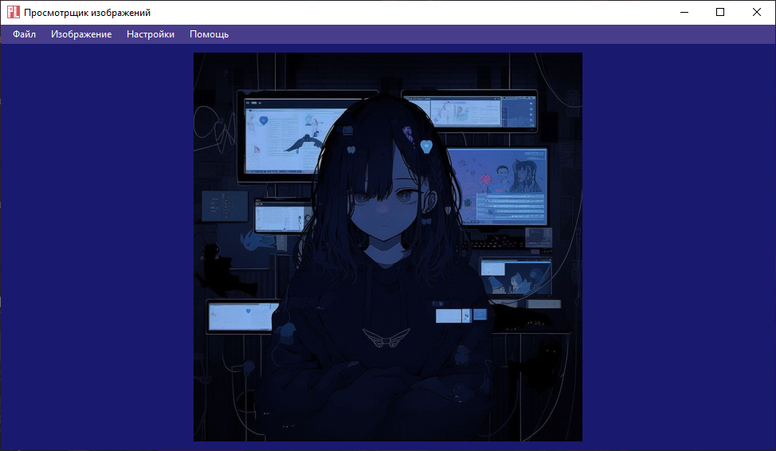
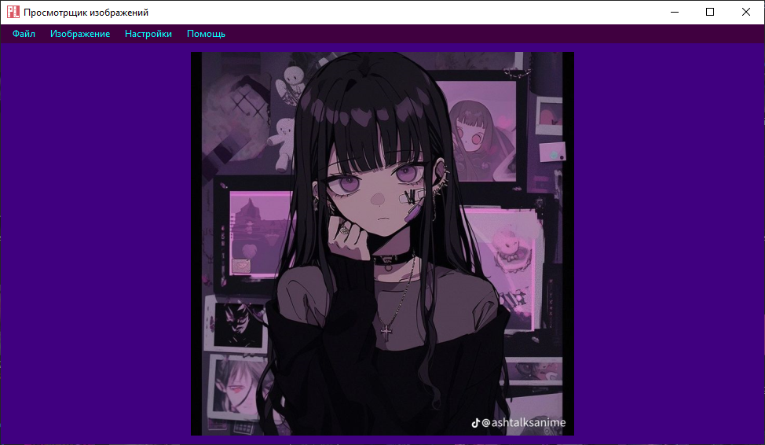

# ViewPictures

Я написал программу просмотра изображений на C#.

Рисунок 1. Скриншот главного окна с открытым изображением в светлой теме

Рисунок 2. Скриншот главного окна с открытым изображением в темной теме

Рисунок 3. Импорт темы, поставляемой в комплекте с программой CyberPunk

## Преимущества:
+ Имеет удобный дизайн;
+ Программа легко закрывается кнопкой esc;
+ Поддерживает поворот изображения;
+ Быстрый запуск;
+ Файлы открываются не только через кнопку "Файл->Открыть", но и через драг он дроп;
+ Если установить просмотр изображений по умолчанию, то все будет работать по двойному клику по изображению в любой директории;
+ Есть возможность получить информацию об изображении;
+ Есть возможность масштабировать изображение колесиком мыши и трекбаром;
+ Есть возможность обрезать изображение;
+ Есть возможность поставить изображение на рабочий стол;
+ Доступны фильтры, позволяющие изменить изображение;
+ Возможность изменения размер приложения, которое не сбрасывается после выхода;
+ Возможность создавать свои темы, экспортировать их, а также импортировать;
+ Тема, которую вы установили последней, не исчезнет даже после выхода из программы.

## Минусы:
- Зависит от .Net;
- Не оптимизирован для работы с сильным приближением изображения;
- Некоторые фильтры неоптимизированы и медленны;
- Изображение можно обрезать при установке на главный экран;
- Возможность смены шрифта отключена при создании темы на данный момент (или полностью);
